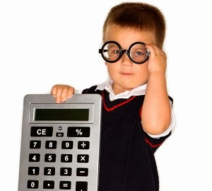

<html xmlns='http://www.w3.org/1999/xhtml' lang='' xml:lang=''>
<head>
	<meta charset='utf-8' />
	<meta name='viewport' content='width=device-width, user-scalable=no' />
	<title>Casio</title>

</head>
<body style="background-color:black;">
  

  

  <h1 style="font-size: 60px; color: #2ecc71">Casio</h1>
    
The biggest calculator revolution starts <u><b>now!</b></u>

  

    

  
 

  
  <!--Obere Reiterbox-->
  
<button class="tablink" onclick="openPage('Store', this, '#2ecc71')">Store</button>
<button class="tablink" onclick="openPage('Casedesigner', this, '#2ecc71')" >Case Designer(WIP)</button>
<button class="tablink" onclick="openPage('Surveys', this, '#2ecc71')">Surveys</button>
<button class="tablink" onclick="openPage('Improvements', this, '#2ecc71')">Improvements</button>

  

    
 

    
 

  
Would you like a Hightech-math product with a big range of tools & gadgets, or even a case to go with it?

  
Then hit it!

	<a href="https://aaron100-prog.github.io/futurecasio.github.io/Shop" class="button">Store</a>
    
 

    

  

    
 

    
 

  
Comes in the future.

  
(create a custom sleeves and cases for their own taste)

    
<a class="button">
Open Designer
</a>
  Still WIP sry!

    
    
 

    

  

    
 

    
 

    
Participate in our surveys to ensure that we make our products even better and give you, our customers, the very best.

    
 

  

  

    
 

    
 

    
Contact with our customers is very important to us! We love it so much that we decided to create a section on our website for people who want to be involved in the future of our products. We give them the opportunity to share their ideas with the world and of course with us. We look forward to your suggestions.

When we read a great idea, we ask our customers in the poll section if they think this idea should be used in future updates or projects.

    
 

  

  
  <!--Untere Reiterbox-->
  
<button class="tablink" onclick="openPage2('Donations', this, '#2ecc71')">Donations</button>
<button class="tablink" onclick="openPage2('Aboutus', this, '#2ecc71')" >About us</button>
<button class="tablink" onclick="openPage2('Reviews', this, '#2ecc71')">Reviews</button>
<button class="tablink" onclick="openPage2('QandA', this, '#2ecc71')">Q&A</button>
  
  

    

    
 

    
 

    
 

    
Would you like to support other than buying and using our products? Then you can also donate to us here, which we use to improve our work and for various foundations such as cancer research or the environment.

      
 

      

  

  
 

    
 

    
 

  
We are a subsidiary of calculator giant Casio, which has set itself the task of developing a n ultramodern educational device that will be sold in industrialized places such as the USA, Japan and parts of Europe.
 
    
 Our priorities are customer friendliness, openness and efficiency.
 
    
 

    

  

    
 

    
 

    
 

  
Criticism can be hard, but it can also be useful. Thank you to everyone who uses the review section to share with us the problems as well as the positives they encountered while using our products. You are also welcome to rate our central points such as technology, number of functions and possibilities with points from 1 to 10.

    
 

    

  
 

    
 

    
 

  <button class="accordion">
What is casio connection and how does it work?
</button>

  
Casio Connection is an app adapted for school lessons. If the teacher connects their laptop to the product with a cable and Casio Connection is activated on their own device, he is the host and all students only need to activate Casio Connection as well. Then the teacher can directly set in the app which features should be on and which should be off, so that the students cannot cheat in tests, for example. If someone disconnects, the teacher sees this and recognizes the attempted fraud.

  <button class="accordion">
What are your plans for the future?
</button>

  
For the time being, we will mainly focus on our hopefully soon launch and will provide our device with more and more tools.
If our product is very well received, we will move more and more towards a school device in the future and move away from the focus on math.

  <button class="accordion">
When will you start with the production
</button>

  
Mrs. Schäfer, please give us a good mark for our project. The whole thing took so long. Don't we deserve it?!

  
 

  
If you have any other problems with our products or have any other questions, please don't hesitate to ask our friendly staff who will assist you in any way and as soon as possible

  

	  <a href="https://aaron100-prog.github.io/futurecasio.github.io/Support" class="button">Support</a>
    

  
 

  
  
  
    
    
  
  
	  
<footer>
  

  

	  

		  
 

  
 

	  
<a href="https://aaron100-prog.github.io/futurecasio.github.io/Cookies">Cookies</a>

	  
<a href="https://aaron100-prog.github.io/futurecasio.github.io/Legal">Legal</a>

	  
<a href="https://aaron100-prog.github.io/futurecasio.github.io/Privacy">Privacy</a>

		  

  

  

	  

		  
 

  
 

    
<a href="https://aaron100-prog.github.io/futurecasio.github.io/Support">Support</a>

	  
<a href="https://aaron100-prog.github.io/futurecasio.github.io/Help">Help</a>

	  
<a href="https://aaron100-prog.github.io/futurecasio.github.io/Credits">Credits</a>

	  

  

	

	
 <button class="btn"><i class=""></i></button> 
 
	
 <button class="btn"><i class=""></i></button> 
 
	
 <button class="btn"><i class=""></i></button> 

		
 

	  
	

</footer> 
</body>
</html> 
